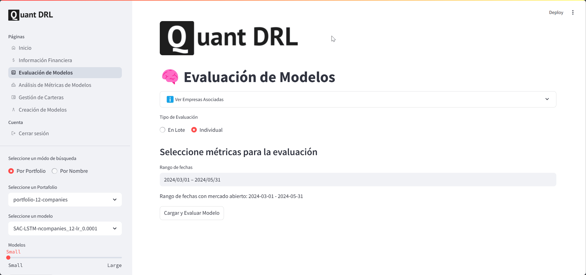

# 📊 quant-drl-web

**quant-drl-web** is a Streamlit-based interactive dashboard for visualizing, evaluating, and simulating Deep Reinforcement Learning (DRL) models applied to portfolio management.

It serves as the frontend for the [`quant-drl-core`](https://github.com/pablodieaco/quant-drl-core) research framework, providing a user-friendly interface for financial data exploration, model comparison, and portfolio decision analysis.

> 🎓 Developed as part of my **Final Degree Project (TFG)** in the **Double Degree in Mathematics and Computer Engineering** at the **University of Seville**.

---

## ✨ Features

- 📈 **Model evaluation & metrics explorer**
- 💡 **Portfolio simulation and strategy testing**
- 🧠 **Deep RL integration** (PPO, SAC)
- 🔌 **Database-backed** via PostgreSQL
- 🎨 **Streamlit** multipage navigation
- 🐳 Docker & Docker Compose for deployment
- 📂 Examples and demo models included

---

## 🖼️ App Preview

### 📊 Financial Information  
An overview of each company's economic and financial data.


---

### 📝 Evaluations

#### 🧪 Batch Evaluation  
Evaluate multiple simulation at once, and analyse the performance of your model.


#### 🔍 Individual Evaluation  
Dive deep into the analysis of a single simulation.



---

### 📈 Metrics Analysis  
Explore key performance indicators of your trained models.


## 📁 Project Structure

```bash
quant-drl-web/
├── web/                # Streamlit app (modular)
│   ├── app.py          # Main entry point
│   ├── pages/          # UI Pages (Streamlit multipage)
│   ├── commons/        # Session & layout
│   └── db/             # DB scripts and seeders
├── examples/           # Sample models and evaluation results
│   ├── models/         # Pretrained DRL models
│   └── results/        # evaluation_results.csv
├── docker-compose.yml  # Launch web + PostgreSQL
├── Dockerfile          # Web app container
├── build.sh            # Script to copy core + build
└── requirements.txt    # Python dependencies
```

---

## ⚙️ Requirements

- Docker & Docker Compose
- Python 3.10+ (optional for local runs)
- `quant-drl-core` available locally (used during build) (TODO: It will not be necessary in future releases)

---

## 🚀 Quickstart

### 1. Clone the repo 
```bash
git clone https://github.com/pablodieaco/quant-drl-web.git
cd quant-drl-web
```

### 2. Run using the latest Docker image (recommended)
This will pull the latest published image from GitHub Container Registry and run the app.

```bash
make run
```

Once running, the app will be available at http://localhost:8501

### 3. Run using the develop image (development mode)
```bash
make run PROFILE=develop
```

### 4. Local development mode (with local quant-drl-core)
If you're modifying `quant-drl-web` and want to test changes locally:

```bash
make build 
make run-local
```
This will

- Build the Docker image with your local changes
- Launch the app using the new built image

Once running, the app will also be available at http://localhost:8501

### 5. Launch the app

```bash
docker-compose up
```
Once running, the app will be available at http://localhost:8501

### 6. Alternative: Build and Launch

```bash
./build.sh yes
```

---

## 🧪 Example Models

We’ve included pretrained models and example evaluation results inside the `examples/` folder:
- `examples/models/` → PPO and SAC agents
- `examples/results/evaluation_results.csv`→ model evaluation scores

---

## 🧠 About this project

This dashboard is part of a broader research framework:

👉 Check out `quant-drl-core` for:
- DRL training pipelines (PPO, SAC)
- Custom Gym environments
- Evaluation and visualization logic
- Experiment reproducibility


## 📝 License

This project is licensed under the **MIT License**.  
See the [LICENSE](./LICENSE) file for details.

---

## 🙋‍♂️ Author

Made with ❤️ by **Pablo Diego Acosta**

- 💼 LinkedIn: [linkedin.com/in/pablodiegoacosta](https://www.linkedin.com/in/pablodiegoacosta)

---

## ✨ Todo / Ideas

- [ ] Embed live charts from financial APIs
- [ ] Auto-refresh evaluation dashboard with scheduled updates
- [ ] Live inference from trained DRL models